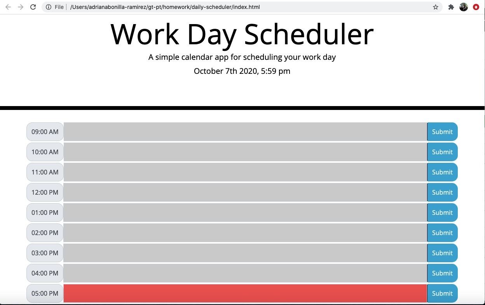
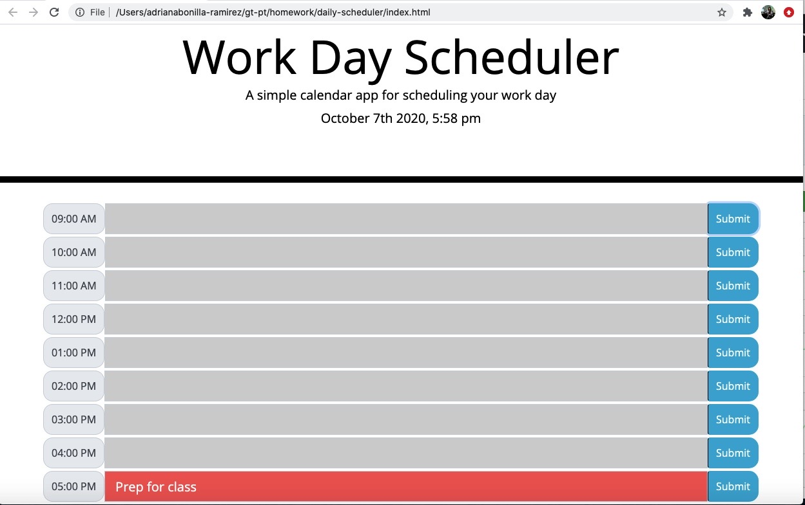

# daily-scheduler

## Objective

The objective of this project is to create a simple calendar application that allows a user to save events for each hour of the day. The header has a title and displays current date and time. 
Hours in the past are gray, the present hour is red, and future hours are green.
Input entered by the user will be saved and will remain in the scheduler even if the form is refreshed.

## Development

- Define layout
- Read documentation about moment and understand how to use it
- Define hours and buttons
- Develop logic to create elements in the DOM
- Develop the logic to change style for present, past and future

## Testing

- Test functionality at different hours of the day
- Put code through code checker
- Read about the deprecation warning alert that I get in the console, and determine that it is not affecting current functionality

## Deployment

Visit the application here - https://adrianalbr.github.io/daily-scheduler/

Visit the repo here - https://github.com/adrianalbr/daily-scheduler

## How it works

The schedule shows you empty forms where you can enter an item for each hour of the day - current time is red

When you enter an item and hit the submit button it saves your entry even when you refresh the page

- - -
© 2020 Adriana Bonilla-Ramirez. All Rights Reserved.
